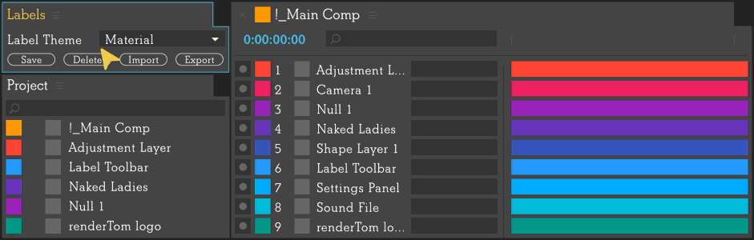
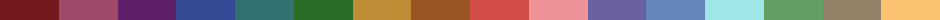
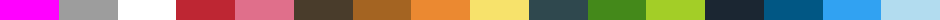
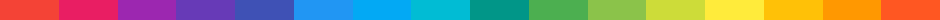
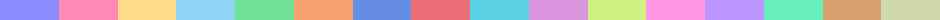
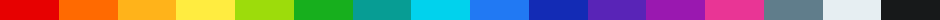
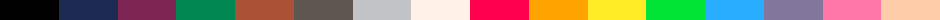

# Labels #

Collection of Label Themes and Script Snippets for Adobe After Effects script [Labels](https://aescripts.com/labels/)

## Themes ##

* David Arbor theme <https://vimeo.com/davidarbor> [](https://github.com/rendertom/Labels/blob/master/zip/Themes/David%20Arbor.theme.zip)
* Generic 16 CGP by Arne Niklas Jansson <http://androidarts.com/palette/16pal.htm> [](https://github.com/rendertom/Labels/blob/master/zip/Themes/Generic%2016%20CGP.theme.zip)
* Material theme based on Googme Material Design <https://material.io> [](https://github.com/rendertom/Labels/blob/master/zip/Themes/Material.theme.zip)
* Pastel colection of pastel colors [](https://github.com/rendertom/Labels/blob/master/zip/Themes/Pastel.theme.zip)
* Paul Conigliaro theme <http://conigs.com> [](https://github.com/rendertom/Labels/blob/master/zip/Themes/Paul%20Conigliaro.theme.zip)
* Pico-8 Game Console Palette by Lexaloffle <https://lexaloffle.com/pico-8.php> [](https://github.com/rendertom/Labels/blob/master/zip/Themes/Pico-8.theme.zip)
* Ryan Summers theme <http://ryansummers.net> [](https://github.com/rendertom/Labels/blob/master/zip/Themes/Ryan%20Summers.theme.zip)
* Vivid almost random colors with bold hues [](https://github.com/rendertom/Labels/blob/master/zip/Themes/Vivid.theme.zip)

## Snippets ##

* [Copy Color To Clipboard](URL) - copies labels HEX color to clipboard.
* [Create Shape Layer](URL) - creates a full sized Shape Layer and sets Fill color label color,
* [Create Solid Layer](URL) - creates a full sized Solid Layer and sets its source color label color,
* [Group Layers](URL) - groups all layers with same label color together underneath the topmost layer with that color,
* [Parent Layers to Null](URL) - parents all layers with the same label color to a null,
* [Push Layers Back By One](URL) - push layers with this label to the bottom of the layer stack one by one,
* [Push Layers Up By One](URL) - pushes layers with this label to the top of the layer stack one by one,
* [Shy Everything Except](URL) toggles 'solo' property of all layers that do not match given label color in composition,
* [Toggle Shy](URL) - toggles 'shy' property of all layers with given label color in composition,
* [Toggle Solo](URL) - toggles 'shy' property of all layers with given label color in composition.

``` javascript
Labels script exposes following API:
    index (Number) label index,
    hex   (String) label HEX color,
    rgb   (Array)  label RGB color [0-255, 0-255, 0-255],
    name  (String) label name
```