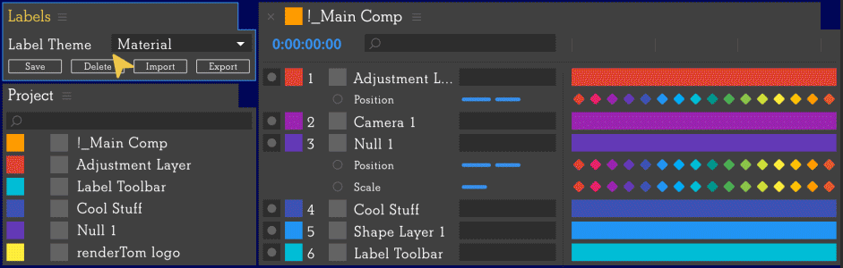

# Labels #

Collection of script Snippets and label Themes for Adobe After Effects script [Labels](https://aescripts.com/labels/)

## How to ##

Read how to use all of this in the [documentation](https://labels.rendertom.com/#/)


## Snippets ##

Download all snippets [here](https://github.com/rendertom/Labels/releases/download/assets/Snippets.zip)

* [Copy Color To Clipboard](Snippets/Copy%20Color%20To%20Clipboard.js) - copies labels HEX color to the clipboard,
* [Create Shape Layer](Snippets/Create%20Shape%20Layer.js) - creates a full sized Shape Layer and sets Fill color to the label color,
* [Create Solid Layer](Snippets/Create%20Solid%20Layer.js) - creates a full sized Solid Layer and sets its source color to the label color,
* [Group Layers](Snippets/Group%20Layers.js) - groups all layers with same label color together underneath the topmost layer with that color,
* [Parent Layers to Null](Snippets/Parent%20Layers%20to%20Null.js) - parents all layers with the same label color to a null,
* [Push Layers Back By One](Snippets/Push%20Layers%20Back%20By%20One.js) - pushes layers with this label to the bottom of the layer stack one by one,
* [Push Layers Up By One](Snippets/Push%20Layers%20Up%20By%20One.js) - pushes layers with this label to the top of the layer stack one by one,
* [Shy Everything Except](Snippets/Shy%20Everything%20Except.js) toggles 'solo' property of all layers that do not match given label color in composition,
* [Toggle Shy](Snippets/Toggle%20Shy.js) - toggles 'shy' property of all layers with given label color in composition,
* [Toggle Solo](Snippets/Toggle%20Solo.js) - toggles 'solo' property of all layers with given label color in composition.

``` javascript
Labels script exposes the following API:

index (Number)    // label index,
hex (String)      // label HEX color,
rgb ([Number])    // label RGB color [0-255, 0-255, 0-255]
name (String)     // label name
```

``` javascript
// Get an active composition
var composition = app.project.activeItem;
if (!composition || !(composition instanceof CompItem)) {
  return alert('Please select a composition first');
}

// Create a Solid Layer with base color of Labels.rgb
var layer = composition.layers.addSolid(
  Labels.rgb / 255,
  'My Layer',
  composition.width,
  composition.height,
  1
);

// Set layers comment to Labels.hex color:
layer.comment = Labels.hex;

// Set layer name to Label.name
myLayer.name = Labels.name;

// Check if layer index matches Labels.index:
var layerIndex = layer.index;
var labelsIndex = Labels.index;
if (layerIndex === labelsIndex) {
  alert('Layer index of ' layerIndex + ' matches the label index of ' + labelsIndex);
} else {
  alert('Layer index of ' + layerIndex + ' does not match the label index of ' + labelsIndex);
}
```

## Themes ##

Download all themes [here](https://github.com/rendertom/Labels/releases/download/assets/Themes.zip) or pick the one you like from the list below (and save it with extension **.theme**).

* [David Arbor](https://www.davidarbor.com/) theme [](Themes/David%20Arbor.theme)
* Generic Color Game Palette v16 CGP by [Arne Niklas Jansson](http://androidarts.com/palette/16pal.htm) [](Themes/Generic%2016%20CGP.theme)
* Material theme based on [Google Material Design](https://material.io) [](Themes/Material.theme)
* Colection of pastel colors [](Themes/Pastel.theme)
* [Paul Conigliaro](http://conigs.com) ( [@Conigs](https://twitter.com/conigs) ) theme [](Themes/Paul%20Conigliaro.theme)
* Pico-8 Game Console Palette by [Lexaloffle](https://lexaloffle.com/pico-8.php) [](Themes/Pico-8.theme)
* [Ryan Summers](http://ryansummers.net) ( [@Oddernod](https://twitter.com/Oddernod) ) theme with custom Label Assignments [](Themes/Ryan%20Summers.theme)
* Vivid, almost random colors with bold hues [](Themes/Vivid.theme)